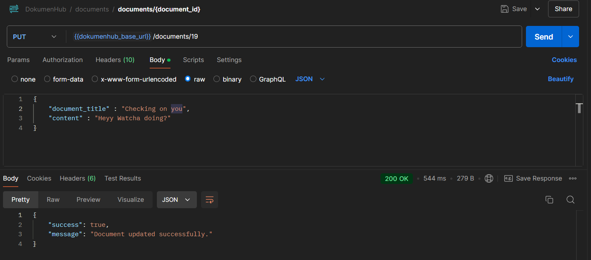

# DokumenHub

DokumenHub is a robust document management application that empowers users to create, edit, and manage their documents efficiently. Leveraging the power of Next.js, MySQL, and MongoDB, DokumenHub offers a seamless user experience with features like secure authentication and an intuitive editor interface inspired by Notion.

## Features

- **User Authentication:** Secure login using Google Authentication via Firebase, ensuring that user data is protected and accessible only to authorized individuals.
  
- **Document Management:**
  - **Create Documents:** Users can effortlessly create new documents using a user-friendly editor powered by Editor.js.
  - **Edit Documents:** Easily modify existing documents with real-time updates and autosave functionality.
  - **Delete Documents:** Remove documents from your workspace, with options to restore if needed.
  
- **Intuitive Editor Interface:** A clean and responsive editor interface inspired by Notion, facilitating an enhanced writing and editing experience.
  
- **Responsive Design:** DokumenHub is fully responsive, ensuring optimal usability across various devices, including desktops, tablets, and smartphones.
  
- **Consistent Code Formatting:** Utilizes Prettier for maintaining clean and consistent code, enhancing readability and maintainability.


## Technologies Used

- **Client-Side:** 
  - [Next.js](https://nextjs.org/) - A React framework for building server-side rendered applications.
  - [React](https://reactjs.org/) - JavaScript library for building user interfaces.
  - [Tailwind CSS](https://tailwindcss.com/) - Utility-first CSS framework for styling (via CDN).
  - [Editor.js](https://editorjs.io/) - A block-styled editor for rich content editing.

- **Server-Side:** 
  - [Next.js](https://nextjs.org/) - A React framework for building server-side rendered applications.

- **Databases:**
  - [MySQL](https://www.mysql.com/) - Relational database for structured data management.
  - [MongoDB](https://www.mongodb.com/) - NoSQL database for storing document content.

- **Authentication:**
  - [Firebase](https://firebase.google.com/) - Provides Google Authentication and user management.

- **Utilities:**
  - [Prettier](https://prettier.io/) - Code formatter for maintaining consistent code style.

## Architecture Diagram


## Database Schema

### MySQL

- Users Table

| Column          | Type                | Description                            |
|-----------------|---------------------|----------------------------------------|
| `id`            | INT, Auto-Increment | Primary Key                            |
| `email`         | VARCHAR(255)        | Unique user email                      |
| `username`      | VARCHAR(255)        | User's display name                    |
| `profile_image` | VARCHAR(255)        | URL to the user's profile image        |
| `auth_uid`      | VARCHAR(255)        | Unique ID for Firebase authentication  |
| `created_at`    | DATETIME            | Timestamp when user was created        |

    


- Documents Table


| Column           | Type                | Description                             |
|------------------|---------------------|-----------------------------------------|
| `document_id`    | INT, Auto-Increment | Primary Key                             |
| `document_title` | VARCHAR(255)        | Title of the document                   |
| `user_id`        | INT                 | Foreign Key referencing Users.id        |
| `created_at`     | DATETIME            | Timestamp when document was created     |
| `updated_at`     | DATETIME            | Timestamp of the last update            |
| `deleted_at`     | DATETIME            | Timestamp for soft delete management    |


- Shared_Documents Table

| Column            | Type                | Description                                      |
|-------------------|---------------------|--------------------------------------------------|
| `shared_id`       | INT, Auto-Increment | Primary Key                                      |
| `document_id`     | INT                 | Foreign Key referencing Documents.document_id    |
| `shared_with_id`  | INT                 | Foreign Key referencing Users.user_id            |
| `shared_at`       | DATETIME            | Timestamp when document was shared               |


### MongoDB

- Document Content Collection

| Field           | Type   | Description                               |
|-----------------|--------|-------------------------------------------|
| `_id`           | ObjectId | Auto-generated unique ID                  |
| `document_id`   | INT    | References MySQL Documents.document_id    |
| `content`       | JSON   | Data structure from Editor.js             |
| `history`       | Array  | Tracks changes and edits                  |
| `last_modified` | Date   | Timestamp of the last update              |


## API Design

### Authentication Endpoints

- `POST /api/auth/login`: Authenticate user via Google login using Firebase.

    

- `POST /api/auth/logout`: Logout user and clear session.

### Document Management Endpoints

- `GET /api/documents`: Fetch all documents for the authenticated user (includes private and shared documents).

    

- `POST /api/documents`: Create a new document in MySQL and save content in MongoDB.

    

- `GET /api/documents/:id`: Retrieve a specific document and its content.

    

- `PUT /api/documents/:id`: Update an existing document's title or content.

    

- `DELETE /api/documents/:id`: Move document to trash (soft delete).

    

> **Note:** API for sharing, trash management, and chat is not implemented yet and will be developed in the next phase.

## Installation

1. **Clone the repository:**
   ```bash
   git clone https://github.com/Pragati-C19/DokumenHub.git
   ```

2. **Navigate to the project directory:**
   ```bash
   cd DokumenHub
   ```

3. **Install dependencies:**
   ```bash
   npm install
   ```

4. **Set up your environment variables in a `.env` file:**
   ```bash

   # MySql DB Config 
   MYSQL_HOST=localhost
   MYSQL_USER=root
   MYSQL_PASSWORD=your_mysql_password
   MYSQL_DATABASE=dokumenhub

   # MongoDB DB Config 
   MONGODB_URI=mongodb://localhost:27017/?directConnection=true
   MONGODB_DATABASE=dokumenhub

   # Firebase Google Auth Credentials
   NEXT_PUBLIC_FIREBASE_APIKEY=your_firebase_api_key
   NEXT_PUBLIC_FIREBASE_AUTH_DOMAIN=your_firebase_auth_domain
   NEXT_PUBLIC_FIREBASE_PROJECT_ID=your_firebase_project_id
   NEXT_PUBLIC_FIREBASE_STORAGE_BUCKET=your_firebase_storage_bucket
   NEXT_PUBLIC_FIREBASE_MESSAGING_SENDER_ID=your_firebase_messaging_sender_id
   NEXT_PUBLIC_FIREBASE_APP_ID=your_firebase_app_id
   NEXT_PUBLIC_FIREBASE_MEASUREMENT_ID=your_firebase_measurement_id

   # JWT Token
   JWT_SECRET_KEY=your_jwt_secret_key
   ```

   > **Note:** Do not expose your `.env` file or commit it to version control. This file contains sensitive information.

   ### Generate a Random JWT Secret Key

   Go to the terminal, type `node`, and then follow the command below to generate a random key:
   ```bash
   node -e "console.log(require('crypto').randomBytes(32).toString('base64'))"
   ```

5. **Run the application:**
   ```bash
   npm run dev
   ```

## Usage

1. **Access the Application:**
   - Open your browser and navigate to [http://localhost:3000](http://localhost:3000).

2. **Sign In:**
   - Click on the "Sign in with Google" button to authenticate using your Google account.

3. **Manage Documents:**
   - **Create:** Click on "Create New Document" to start a new document.
   - **Edit:** Select a document from your dashboard to edit its content.
   - **Delete:** Remove unwanted documents using the delete icon next to each document.


## Styling

Tailwind CSS is the primary styling framework used. Custom CSS is also added for specific components, such as the scroll bar on the homepage. Configuration files like `tailwind.config.js` allow for further customization.

## Figma Design

The DokumenHub project was thoughtfully designed using Figma to provide users with an efficient and user-friendly document management experience. The design emphasizes clarity, organization, and intuitive navigation, allowing users to seamlessly create, edit, and manage their documents. Key components, including the sidebar, document cards, and editor interface, have been crafted to ensure a cohesive and engaging user experience.

You can explore the complete Figma design, which includes detailed wireframes and interactive prototypes, [by following this link](https://www.figma.com/design/RRMk51aGh2MQlJeRSG3SAm/Aventura?node-id=202-4&t=np8qttwLCJ1sm26K-1). This design serves as a foundational reference for the frontend development process, ensuring consistency and alignment with user needs throughout the project.


## UI Design

**Landing Page**


- **Home Page**


- **New Page (Blank Page)**


- **Document List (List View)**


- **Document List (Grid View)**


## Contributing

- Contributions are welcome! Please fork this repository and submit pull requests for any enhancements or bug fixes.
